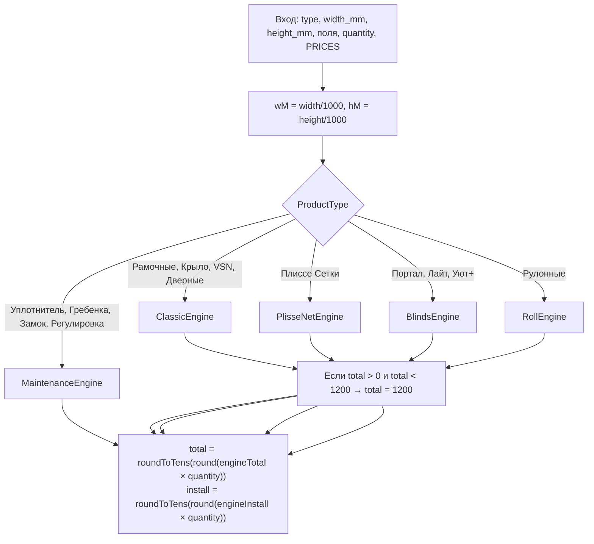

# Схема расчёта продукции (настольный калькулятор / ПК)

Документ описывает **полную бизнес-логику ценообразования** мобильного калькулятора «Замерщик» в виде, пригодном для реализации **настольной (ПК) версии** без дублирования догадок. Источник истины в коде — не этот файл, а перечисленные ниже модули; при расхождении побеждает код.

| Назначение | Файл |
|------------|------|
| Формулы и движки | `logic/calculations.ts` |
| Прайс (коэффициенты, ₽) | `constants.ts` → `PRICES` |
| Типы изделий и полей | `types.ts` |
| Итог заказа (доставка, скидка, QR) | `logic/orderTotals.ts` |
| Какие поля UI у какого типа | `.cursor/rules/calculator-ui-field-matrix.mdc` |

---

## 1. Общий поток



### 1.1. Сигнатура `calculatePrice`

```ts
calculatePrice(
  type: ProductType,
  width: number,        // мм; для услуг может быть 0
  height: number,       // мм
  color: ColorType,
  mesh: MeshType,
  opening: PlisseOpening,
  threshold: PlisseThreshold,
  handles: number,
  quantity: number,
  subType: 'window' | 'door' | 'pvc' | 'alu',
  mount: MountType,
  cornerType: CornerType,
  handleType: HandleType,
  prices: PRICES,
  doorProfile?: '32' | '42',   // default '42'
  hingesCount?: number,        // default 3
  hasLatch?: boolean,          // default true
  hasBolt?: boolean,           // default false
  frameProfile?: '25' | '32'  // default '25'
): { total: number; install: number }
```

**Услуги** (`SEAL`, `COMB`, `CHILD_LOCK`, `ADJUSTMENT`): размеры не используются; глобальный минимум **1200 ₽ не применяется** (возвращается сразу после округления).

### 1.2. Округление

```ts
roundToTens(x) = Math.round(x / 10) * 10
```

Порядок для позиции:

1. Движок считает `total` (и `install`) **без** `roundToTens`.
2. `total × quantity` → `Math.round` → `roundToTens`.
3. То же для `install`.

Примеры: 8179 → 8180; 6112 → 6110; 2396 → 2400.

### 1.3. Глобальный минимум позиции

После движка (кроме Maintenance):

```
если 0 < total < 1200 → total = 1200
```

Заградительные минимумы **рамочных** (только `FRAME`, см. §3.6) применяются **внутри** ClassicEngine **до** этого порога.

---

## 2. Изоляция прайса по группам

Каждый движок читает **только свой** раздел `PRICES.price_settings`:

| Движок | Раздел `price_settings` | ProductType |
|--------|-------------------------|-------------|
| ClassicEngine | `classic_frames` | `FRAME`, `WING`, `INSIDE_INSERT`, `DOOR` |
| PlisseNetEngine | `plisse_nets` | `PLISSE_NET` |
| BlindsEngine | `plisse_nets` + `plisse_blinds` | `JALOUSIE_*` (см. §5) |
| RollEngine | `roll_nets` | `ROLL` |
| MaintenanceEngine | `window_works` | `SEAL`, `COMB`, `CHILD_LOCK`, `ADJUSTMENT` |

**Исключение:** «Штора Портал» (`JALOUSIE_CLASSIC`) = каркас/фурнитура как у плиссе-сетки (`plisse_nets`), полотно = ткань из `plisse_blinds.fabrics_m2`.

---

## 3. ClassicEngine — рамочная линейка и двери

**Переменные:** `wM`, `hM` (м), `CF = price_settings.classic_frames`.

### 3.1. Цвет для прайса (`lookupColor`)

| Условие `color` | `lookupColor` для профиля/углов/крепления |
|-----------------|-------------------------------------------|
| `ral`, `unpainted`, `anthracite`, `beige` | `white` |
| иначе | как есть (`white`, `brown`, `gray`, `black`, …) |

### 3.2. RAL — принудительные опции

Если `color === 'ral'`:

| Поле | Эффективное значение |
|------|----------------------|
| Уголки | всегда `aluminum` |
| Ручки (не дверь) | всегда `metal` |
| Крепление | если было `standard` → `z_metal` |

Доплата RAL (после наценки):

```
ralExtra = max(ral_surcharge, ceil(perimeter) × ral_painting_rate_m)
```

По умолчанию: `ral_surcharge = 1000`, `ral_painting_rate_m = 220` ₽/м.  
`perimeter = 2 × (wM + hM)` — **без** коэффициента отходов.

### 3.3. Базовые геометрии

```
perimeter = (wM + hM) × 2
areaMesh  = (wM + 0.1) × (hM + 0.1)    // м², запас 100 мм на сторону
waste     = profile_waste_factor || 1.1   // сейчас 1.1
```

### 3.4. Профиль и уголки по типу

#### `FRAME` (Рамочные)

| `frameProfile` | Ключ профиля | Уголки |
|----------------|--------------|--------|
| `'25'` | `profiles.standard_25mm[lookupColor]` | `'25'` + `aluminum` → `corners.aluminum_25mm`; иначе `plastic_25mm` |
| `'32'` | `profiles.standard_32mm[lookupColor]` | **всегда** `corners.plastic_32mm` (алюминий в UI для 32 мм недоступен) |

#### `WING` (Крыло)

- Профиль: `profiles.wing_30mm[lookupColor]`
- Уголки: `corners.plastic_25mm[lookupColor]`
- Импост: как у `FRAME` при `hM > 1.0`

#### `INSIDE_INSERT` (Внутривставные VSN)

- Профиль: `profiles.vsn_vsm_25mm[lookupColor]`
- Уголки: `corners.vsn_vsm_25mm[lookupColor]`
- Импост: **нет**

#### `DOOR` (Дверные)

| `doorProfile` | Профиль | Уголки |
|---------------|---------|--------|
| `'32'` | `standard_32mm` | `door_42mm_internal_external` (фикс. 21 ₽) |
| `'42'` | `door_42mm` | то же |

Фурнитура двери:

```
materials += hingesCount × hinges_42mm.standard[lookupColor]
           + handle_door_42mm[lookupColor]
           + (hasLatch ? door_latch[lookupColor] : 0)
           + (hasBolt ? door_bolt : 0)
```

Сборка: `door_assembly_labor` (850), наценка: `door_profit_multiplier` (2.8).  
Установка: **1000 ₽**.

### 3.5. Материалы (общая часть)

```
mPrice = meshes[mesh] || meshes.standard

cordCost = perimeter × mounts.cord_5mm    // 6 ₽/м

mountCost:
  plunger → 4 × pin_41mm               // 95 ₽/шт
  z_metal → perimeter × z_metal[lookupColor]
  иначе   → perimeter × z_plastic[lookupColor]   // standard / Z-пластик

materials = perimeter × pPrice × waste
          + 4 × cPrice
          + areaMesh × mPrice
          + cordCost
          + mountCost
```

**Импост** (только `FRAME` и `WING`, если `hM > 1.0`):

```
materials += wM × impost_25mm[lookupColor] × waste
          + 2 × impost_bracket          // 15 ₽
          + 12 × screw                  // 1 ₽
```

**Ручка** (не дверь):

```
materials += effHandle === 'metal'
  ? handle_frame_metal[lookupColor]
  : handle_frame_plastic[lookupColor]
```

### 3.6. Итог ClassicEngine

```
labor = (DOOR ? door_assembly_labor : assembly_labor)   // 850 / 250
mult  = (DOOR ? door_profit_multiplier : company_profit_multiplier)  // 2.8 / 2.0

total = (materials + labor) × mult
if RAL: total += ralExtra

if FRAME:
  minByMesh = { standard:1400, antimosquito:1980, antimoshka:1980,
                anticat:2400, antipollen:3000, antipyl:3000 }[mesh] ?? 1400
  total = max(total, minByMesh)

install = (DOOR ? 1000 : 800)
```

### 3.7. Прайс classic_frames (справочник)

**Наценки:** `assembly_labor=250`, `door_assembly_labor=850`, `company_profit_multiplier=2.0`, `door_profit_multiplier=2.8`, `profile_waste_factor=1.1`.

**Профили (₽/м):**

| Ключ | white | brown | gray | black |
|------|------:|------:|-----:|------:|
| standard_25mm | 60 | 65 | 116 | 75 |
| standard_32mm | 255 | 260 | 290 | — |
| impost_25mm | 65 | 70 | 121 | 80 |
| wing_30mm | 85 | 90 | 95 | 105 |
| vsn_vsm_25mm | 195 | 200 | 205 | — |
| door_42mm | 290 | 300 | 350 | — |

**Уголки (₽/шт, 4 шт. в формуле):**

| Ключ | white | brown | gray | black |
|------|------:|------:|-----:|------:|
| plastic_25mm | 5 | 5.5 | 20 | 11 |
| aluminum_25mm | 36 | 38 | 50 | 46 |
| plastic_32mm | 19 | 21 | 36 | — |
| vsn_vsm_25mm | 14 | 15 | 24 | — |
| door_42mm_internal_external | 21 (фикс.) | | | |

**Полотна (₽/м²):** standard 65; antimosquito/antimoshka 350; anticat 500; antipollen/antipyl 900.

**Крепление:** cord 6 ₽/м; z_plastic 2–5; z_metal 7–20; pin 95 ₽ (×4); ручки рамки пластик 2 / металл 14.

---

## 4. PlisseNetEngine — плиссе-сетка

`PN = price_settings.plisse_nets`, `mult = profit_multiplier` (3.35).

### 4.1. Цвет

```
lookupColor =
  ral → white
  unpainted | anthracite | beige | brown → как есть
  иначе → white
```

### 4.2. Геометрия

```
wDet = max(0, wM - 0.052)
hDet = max(0, hM - 0.052)
isCounter = (opening === 'counter')

lFrame  = ((wDet×2) + (hDet×2)) × 1.0116
lSash   = isCounter ? hDet×2 : (opening === 'up' ? wDet : hDet)
qtyMesh = (wM × hM) × 1.5054
```

### 4.3. Материалы

| Статья | Формула |
|--------|---------|
| Рама | `lFrame × profiles.frame[lookupColor]` |
| Створка | `lSash × profiles.sash[lookupColor]` |
| Сетка | `qtyMesh × meshes[mesh]` |
| Вставка сетки | `(isCounter ? wDet×2 : (up ? wDet×2 : hDet×2)) × insert_mesh_m` |
| Вставка рамы | `lFrame × 0.5 × insert_frame_m` |
| Нить | counter: `((wM+hM)×16+3.2)×thread_m`; иначе `((wM+hM)×4+0.8)×thread_m` |
| Комплект | `(isCounter ? 2 : 1) × accessories_set` |
| Заклёпки | counter: `16 × rivet_pc` |
| Стопоры | counter: `16 × stopper_pc` |
| Магнит | counter: `hDet×2 × magnetic_strip_m` |
| Порог | `low`: `wDet × low_threshold_m` |
| Ручки | `handles × handle_standard` |
| Упаковка | `packaging` |

```
workAssembly = (wM×hM) × (isCounter ? assembly_rate_meeting : assembly_rate_standard)
subtotal = (sumMaterials + workAssembly) × mult
total = subtotal + subtotal × 0.0357
```

RAL:

```
ralMeters = ceil(lFrame + lSash)
total += max(1000, ralMeters × ral_painting_rate_m)
```

**Установка:** `wM > 1.4` → 2000 ₽, иначе 1000 ₽.

### 4.4. Ключевые константы plisse_nets

- Профили frame: 163–169 ₽/м; sash: 263–275 ₽/м  
- Сетки: standard 255; antikoshka 700; antipyl 650  
- `accessories_set=270`, `packaging=50`, `handle_standard=90`, `low_threshold_m=220`  
- Сборка: 750 / 800 (встречное) за м² площади `wM×hM`

---

## 5. BlindsEngine — шторы плиссе

`PB = plisse_blinds`, `fPrice = mesh.startsWith('fb') ? full_blackout : semi_blackout`  
(520 / 480 ₽ за условный м² ткани).

### 5.1. `JALOUSIE_CLASSIC` (Портал)

Логика как PlisseNetEngine, но вместо `qtyMesh × mesh` :

```
matFabric = (wM × hM) × 1.4865 × fPrice
```

Остальные строки материалов — как §4. Наценка и отход 3.57% — как у сетки. RAL — как §4.

### 5.2. `JALOUSIE_LIGHT` (Лайт)

```
sumMaterials = wM×2 × lite_system.profile_m
             + (wM×hM)×1.4865×fPrice
             + lite_system.accessories_set
workAssembly = (wM×hM) × assembly_rate
total = (sumMaterials + workAssembly) × mult × (1 + 0.0357)
```

`profile_m=140`, `accessories_set=150`, `assembly_rate=750`.

### 5.3. `JALOUSIE_COZY` (Уют+)

```
lookupColor = (ral ? white : color)
lFrame = (wM + hM) × 2
lSash  = (opening === 'side' ? hM : wM)

sumMaterials = lFrame × cozy_system.frame_m[lookupColor]
             + lSash × cozy_system.sash_m[lookupColor]
             + (wM×hM)×1.4865×fPrice
             + cozy_system.accessories_set
workAssembly = (wM×hM) × cozy_system.assembly_rate
```

RAL (только Уют+):

```
total += max(min_per_item, ceil(lFrame + lSash) × rate_m)   // 1000 / 220
```

**Установка** для всех штор (кроме Портала по ширине): **800 ₽** (Портал: как плиссе-сетка, §4).

---

## 6. RollEngine — рулонные

`RN = roll_nets`.

```
perimeter = (wM + hM) × 2
area = wM × hM
materials = perimeter × profiles.standard    // 80 ₽/м
          + area × meshes[mesh]              // standard 65
          + accessories_set                  // 150

total = (materials + assembly_labor) × profit_multiplier   // 250, ×2.0
install = 800
```

Цвет, крепление, уголки в расчёте **не участвуют**.

---

## 7. MaintenanceEngine — услуги

`WW = window_works.labor_rates` — **цена за единицу ввода**, без наценки ×2:

| ProductType | Единица | Поле | Формула unitPrice |
|-------------|---------|------|-------------------|
| `SEAL` | м.п. | — | `seal_replacement_m` (220) |
| `COMB` | шт. | `handleType` | metal → 900, иначе 500 |
| `CHILD_LOCK` | шт. | — | 900 |
| `ADJUSTMENT` | шт. | `subType` | door → 1200, иначе 750 |

```
total = unitPrice × quantity
install = 0
```

Сразу: `roundToTens(round(total))`, без минимума 1200.

---

## 8. Поля ввода по типу изделия (для ПК-формы)

Значения enum — строки из `ProductType` (`'Рамочные'`, `'Плиссе Сетки'`, …).

| Вид | width/height | color | mesh | mount | corner | handle | frameProfile | doorProfile | hinges | latch/bolt | opening | threshold | handles | quantity | subType |
|-----|:---:|:---:|:---:|:---:|:---:|:---:|:---:|:---:|:---:|:---:|:---:|:---:|:---:|:---:|:---:|
| Рамочные | ✓ | ✓ | ✓ | ✓ | ✓ | ✓ | ✓ | — | — | — | — | — | — | ✓ | — |
| Крыло | ✓ | ✓ | ✓ | * | * | * | — | — | — | — | — | — | — | ✓ | — |
| VSN | ✓ | ✓ | ✓ | * | * | * | — | — | — | — | — | — | — | ✓ | — |
| Дверные | ✓ | ✓ | ✓ | * | — | — | — | ✓ | ✓ | ✓ | — | — | — | ✓ | — |
| Рулонные | ✓ | ✓ | ✓ | — | — | — | — | — | — | — | — | — | — | ✓ | — |
| Плиссе сетки | ✓ | ✓ | ✓* | — | — | — | — | — | — | — | ✓ | ✓ | ✓ | ✓ | — |
| Портал | ✓ | ✓ | ткань FB/FA | — | — | — | — | — | — | — | ✓ | ✓ | ✓ | ✓ | — |
| Лайт | ✓ | ✓ | ткань | — | — | — | — | — | — | — | — | — | — | ✓ | — |
| Уют+ | ✓ | ✓ | ткань | — | — | — | — | — | — | — | ✓** | — | — | ✓ | — |
| Уплотнитель | — | — | — | — | — | — | — | — | — | — | — | — | — | м.п. | — |
| Гребенка | — | — | — | — | — | ✓ | — | — | — | — | — | — | — | шт. | — |
| Дет. замок | — | — | — | — | — | — | — | — | — | — | — | — | — | шт. | — |
| Регулировка | — | — | — | — | — | — | — | — | — | — | — | — | — | шт. | window/door |

\* для Крыло/VSN/дверей в UI нет блоков крепления/углов/ручек — в state остаются дефолты (`mount=z_metal`, `corner=plastic`, `handle=plastic`), они **всё равно уходят в ClassicEngine** для Крыло (импост+профиль крыла).  
\* плиссе mesh: standard, antikoshka, antipyl.  
\** Уют+: `counter` в UI отфильтрован.

При `color=ral` на классике UI принудительно: aluminum + metal + z_metal (если был standard).

---

## 9. Итог заказа (ПК: корзина / счёт)

Функция: `calculateOrderTotals(order, prices)` в `logic/orderTotals.ts`.

Позиция уже содержит готовые `item.price` и `item.installPrice` из `calculatePrice`.

```
itemsBasePrice = Σ item.price

productCount = число позиций, где type ∉ услуги

measurementFee =
  includeMeasurementFee === true
  AND productCount > 0
  AND замер НЕ оплачен наличными заранее
  ? logistics.measurement_fee (1000)
  : 0

itemsTotalWithFee = itemsBasePrice + measurementFee
```

### 9.1. Установка (если `globalInstall`)

| Условие | Стоимость |
|---------|-----------|
| 1 позиция, тип `FRAME` или `WING` | **900** (не `installPrice` позиции!) |
| 1 позиция, другой тип | `item.installPrice` |
| Несколько позиций | `FRAME`/`WING`: **500 × quantity** каждая; остальные: `installPrice × quantity` |
| `installOverride` задан | max(0, override) вместо авто |

### 9.2. Доставка

| `deliveryType` | Формула |
|----------------|---------|
| `city` | `delivery_base` (1000) |
| `out` | `delivery_base + deliveryKm × delivery_km` (50 ₽/км) |
| `pickup` | 0 |

### 9.3. Скидка и оплата

```
subtotalBeforeDiscount = itemsTotalWithFee + installTotal + deliveryCost
subtotalAfterDiscount = roundToTens(round(subtotalBeforeDiscount × (1 - discountPercent/100)))
discountPercent ∈ {0, 5, 10}

paymentSurcharge = (paymentMethod === 'qr')
  ? roundToTens(round(subtotalAfterDiscount × 0.08))
  : 0

grandTotal = subtotalAfterDiscount + paymentSurcharge
```

### 9.4. Итог «в работу» для менеджера

`calculateManagerWorkTotal`: считает заказ **с** платой за замер, затем если `isMeasurementPaidCash` и есть изделия — вычитает `measurement_fee` из `grandTotal`.

---

## 10. Контрольный пример (верификация ПК)

**Рамочные**, 600×1200 мм, серый, стандарт, профиль **25**, алюминий, металл, Z-металл, qty=1.

```
wM=0.6, hM=1.2, perimeter=3.6, areaMesh=0.91
pPrice=116, cPrice=50, mPrice=65, waste=1.1

profile part     = 3.6 × 116 × 1.1 = 459.36
corners          = 200
mesh             = 59.15
cord             = 21.6
z_metal          = 72
impost           = 0.6×121×1.1 + 30 + 12 = 121.86
handle metal     = 14
materials        ≈ 947.97

total = (947.97 + 250) × 2 = 2395.94 → round 2396 → roundToTens → 2400
install (позиция) = 800; в заказе с 1 рамкой и globalInstall может стать 900 (§9.1)
```

---

## 11. Реализация на ПК (рекомендации)

1. **Импортировать** `calculatePrice` и `calculateOrderTotals` из репозитория (или вынести `logic/` + `constants.ts` в общий npm-пакет) — не копировать коэффициенты вручную.
2. Подгружать `PRICES` из Firebase/файла так же, как мобильное приложение (`prices` prop), если на ПК нужны актуальные прайсы.
3. Для каждой строки корзины сохранять **все** поля `CartItem` из `types.ts` — иначе пересчёт архива не совпадёт.
4. Отдельно показывать `install` позиции и итог установки заказа (правило 900/500 для рамок).
5. Услуги вводить без мм; `width`/`height` = 0 допустимы.

---

## 12. JSON-схема и офлайн-прайс (ПК)

### 12.1. JSON Schema входных полей

Файл: [`desktop-calculator-input.schema.json`](./desktop-calculator-input.schema.json)

| `$defs` | Назначение |
|---------|------------|
| `calculatePriceInput` | Все аргументы `calculatePrice` + `allOf` по типу изделия |
| `cartItem` | Позиция корзины после расчёта |
| `orderState` | Заказ для `calculateOrderTotals` |

Пример валидации ввода расчёта (псевдокод):

```ts
import schema from './desktop-calculator-input.schema.json';
import Ajv from 'ajv';
const validate = new Ajv({ allErrors: true }).compile(schema.$defs.calculatePriceInput);
validate({ type: 'Рамочные', width: 600, height: 1200, quantity: 1, ... });
```

### 12.2. Экспорт прайса в CSV / JSON

Команда из корня репозитория:

```bash
npm run export:desktop-prices
```

Результат в каталоге [`docs/prices-export/`](./prices-export/):

| Файл | Содержимое |
|------|------------|
| `prices-flat.csv` | Каждая числовая константа: `price_group`, `path`, `value`, `unit_hint` |
| `prices-structured.csv` | Таблицы профилей/полотен/монтажа: `item_key` × `color` → `price_rub` |
| `prices-full.json` | Весь `price_settings` для импорта в офлайн-ПК |
| `product-fields-matrix.csv` | Матрица полей по `ProductType` |
| `product-fields-matrix.json` | То же в JSON |
| `README.txt` | Краткое описание набора |

После правки `constants.ts` перезапустите экспорт и обновите копию прайса в настольном приложении.

---

## 13. Версия документа

- Сгенерировано по коду репозитория `calc_v2` (ветка на момент создания файла).
- При изменении `logic/calculations.ts` или `constants.ts` обновите этот файл, JSON Schema и экспорт (`npm run export:desktop-prices`).
