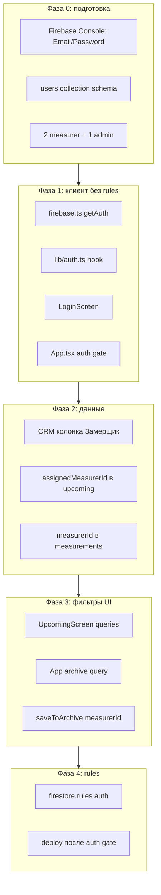

# План внедрения регистрации замерщиков

**Дата:** 2026-06-18  
**Корень проекта:** `D:/calc_v2`  
**Основа:** [docs/app-audit.md](app-audit.md), [docs/app-audit-auth.md](app-audit-auth.md)  
**Принятые решения MVP:** email+password; неназначенные заявки — **общий пул** (видны всем замерщикам); назначенные — только своему `assignedMeasurerId`.

**Важное уточнение по текущему коду (calc_v2 ≠ аудит):**

- [firestore.rules](../firestore.rules) уже **частично ограничены** (не `allow all`), включая бронь `reservationStatus`/`reservedAt` на `upcoming_measurements`.
- [UpcomingScreen.tsx](../screens/UpcomingScreen.tsx) уже использует `runTransaction` для брони — rules и auth нужно расширять **совместно**, не затирая это.
- [App.tsx](../App.tsx) подписывается на **весь** `measurements` без фильтра; splash через 3 сек → `menu` без проверки пользователя.



---

## 1. Цель MVP

Замерщик после входа (email+password):

- видит **свои назначенные** заявки + **общий пул** неназначенных;
- **не видит** заявки, назначенные другому замерщику;
- сохраняет архив только со своим `measurerId` и видит **только свой** архив;
- может **выйти** из аккаунта.

Admin (отдельная роль) — видит всё, редактирует прайс; self-register в UI **не делаем** на первом этапе (аккаунты создаёт admin в Firebase Console / позже Cloud Function).

---

## 2. What делаем первым

1. Включить Email/Password в Firebase Console (без изменения rules).
2. Добавить `getAuth()` в [firebase.ts](../firebase.ts) + типы/hook в новом [lib/auth.ts](../lib/auth.ts).
3. Создать 2–3 тестовых пользователя и документы `users/{uid}` вручную.
4. Добавить `LoginScreen` и **auth gate** в [App.tsx](../App.tsx) — **без** ужесточения rules.
5. Только после стабильного login — поля данных, фильтры, CRM, rules.

---

## 3. What НЕ делаем на первом этапе

- Self-registration без модерации.
- Ужесточение [firestore.rules](../firestore.rules) **до** auth gate в приложении.
- Перенос webhook CRM в Cloud Function (отложить; [ArchiveScreen.tsx](../screens/ArchiveScreen.tsx) не трогать на старте).
- Phone OTP / Google Sign-In.
- Роль `manager`, `installer`, [InstallationScreen.tsx](../screens/InstallationScreen.tsx).
- Миграция/удаление старого admin-пароля — только после role `admin` работает.
- Рефакторинг [logic/calculations.ts](../logic/calculations.ts), [constants.ts](../constants.ts), [CalcScreen.tsx](../screens/CalcScreen.tsx).
- Изменение структуры `PRICES` в constants.

---

## 4. Пошаговый план

### Шаг 0 — Подготовка Firebase (без кода приложения)

| | |
|---|---|
| **Цель** | Auth provider и тестовые аккаунты без риска для prod-приложения |
| **Файлы** | Firebase Console только |
| **Изменения** | Authentication → Sign-in method → Email/Password ON; создать users: `measurer1@test`, `measurer2@test`, `admin@test`; Firestore docs `users/{uid}` |
| **Проверка** | Вход через Firebase Console /REST; документы `users` читаются |
| **Риск** | Низкий |

---

### Шаг 1 — `getAuth()` и auth-хелперы (без UI gate)

| | |
|---|---|
| **Цель** | Подключить Auth SDK, не меняя flow приложения |
| **Файлы** | [firebase.ts](../firebase.ts), новый [lib/auth.ts](../lib/auth.ts), [types.ts](../types.ts) |
| **Изменения** | `import { getAuth } from 'firebase/auth'`; export `auth`; типы `UserRole`, `UserProfile`; функции `signInEmail`, `signOutUser`, `subscribeAuthState`; опционально `getUserProfile(uid)` из `users/{uid}` |
| **Проверка** | `npm run build`; приложение по-прежнему открывает menu после splash |
| **Риск** | Низкий — additive only |

---

### Шаг 2 — Коллекция `users` (схема + типы)

| | |
|---|---|
| **Цель** | Связать `auth.uid` с ролью и профилем |
| **Файлы** | [types.ts](../types.ts) |
| **Изменения** | `UserProfile`: `uid`, `role: 'measurer' \| 'admin'`, `displayName`, `email`, `phone?`, `active`, `createdAt` |
| **Роли MVP** | `measurer`, `admin` |
| **Проверка** | Тестовые docs в Firestore; `active: false` блокирует вход (шаг 4) |
| **Риск** | Низкий |

**Связь uid ↔ профиль:** doc id = Firebase Auth uid; email в Auth и в `users.email` должны совпадать.

---

### Шаг 3 — `LoginScreen` (изолированный экран)

| | |
|---|---|
| **Цель** | UI входа без изменения остальных экранов |
| **Файлы** | новый [screens/LoginScreen.tsx](../screens/LoginScreen.tsx) |
| **Изменения** | email/password, «Войти», обработка ошибок; **без** регистрации; «Обратитесь к администратору» |
| **Проверка** | Экран рендерится (dev-флаг или `currentScreen = 'login'`) |
| **Риск** | Низкий |

---

### Шаг 4 — Auth gate в `App.tsx`

| | |
|---|---|
| **Цель** | Login до menu; корректная работа со splash |
| **Файлы** | [App.tsx](../App.tsx), [screens/MenuScreen.tsx](../screens/MenuScreen.tsx) |
| **Изменения** | `authStatus: 'loading' \| 'anonymous' \| 'authenticated'`, `userProfile`, `authError`. Flow: splash → auth loading → login \| menu. Firestore subscriptions только после auth. Logout в MenuScreen. `active === false` → signOut |
| **Проверка** | Без login не попасть в menu; logout; черновик localStorage сохраняется |
| **Риск** | **Высокий** — монолит App.tsx; менять точечно |

```text
splash (3s) → authLoading → login | menu
authenticated → subscribe prices + archive
logout → unsubscribe → login
```

---

### Шаг 5 — CRM: колонка «Замерщик» + GAS sync

| | |
|---|---|
| **Цель** | `assignedMeasurerId` в `upcoming_measurements` из CRM |
| **Файлы** | [scripts/google-apps-script/firebase-crm.js](../scripts/google-apps-script/firebase-crm.js), Google Sheet «Замеры» |
| **Изменения** | Колонка G — email замерщика. `readMeasurementsSheetWithStats_`: 7 колонок. `buildMeasurementWrite_`: `assignedMeasurerEmail`, `assignedMeasurerId`. Пустая ячейка → null (общий пул). Не wipe `reservationStatus`. Сначала dry run |
| **Маппинг uid** | Lookup email→uid через Firestore `users` или uid в Sheet |
| **Проверка** | Dry run; в Firestore assigned / null |
| **Риск** | **Высокий** для prod CRM |

---

### Шаг 6 — Заявки: фильтрация в `UpcomingScreen`

| | |
|---|---|
| **Цель** | Measurer: свои + пул; не видит чужие назначенные |
| **Файлы** | [UpcomingScreen.tsx](../screens/UpcomingScreen.tsx), [types.ts](../types.ts) |
| **Изменения** | `assignedMeasurerId?`, prop `currentUserId`. Два запроса: (A) `== uid`, (B) `== null`. Client backup filter. Admin — без фильтра. Бронь: `reservedByMeasurerId` |
| **Старые без поля** | Общий пул |
| **Проверка** | M1/M2/admin сценарии |
| **Риск** | Средний — composite index |

---

### Шаг 7 — Архив: `measurerId` при сохранении

| | |
|---|---|
| **Цель** | Новые замеры привязаны к замерщику |
| **Файлы** | [App.tsx](../App.tsx) (`saveToArchive`), [types.ts](../types.ts) |
| **Изменения** | `measurerId`, `measurerName`, `upcomingId?`. Не менять outbox |
| **Проверка** | doc содержит measurerId; offline outbox |
| **Риск** | Средний |

---

### Шаг 8 — Архив: фильтрация чтения

| | |
|---|---|
| **Цель** | Measurer видит только свой архив |
| **Файлы** | [App.tsx](../App.tsx) |
| **Изменения** | `where('measurerId', '==', uid)` для measurer; admin — full query. Старые без `measurerId` — только admin |
| **Проверка** | M1 не видит архив M2 |
| **Риск** | Средний |

---

### Шаг 9 — Firestore rules (поэтапно)

| | |
|---|---|
| **Цель** | Server-side изоляция |
| **Файлы** | [firestore.rules](../firestore.rules) |
| **Порядок** | 9a users → 9b upcoming → 9c measurements → 9d config/prices. Deploy **после** шагов 4+6+7+8 в prod APK |
| **Staging** | Emulator или deploy в нерабочее время |
| **Проверка** | Rules Playground, 2 аккаунта |
| **Риск** | **Критический** — backup rules перед deploy |

---

### Шаг 10 — Admin: role вместо пароля

| | |
|---|---|
| **Цель** | AdminScreen только для `role === 'admin'` |
| **Файлы** | [App.tsx](../App.tsx), [AdminScreen.tsx](../screens/AdminScreen.tsx), [MenuScreen.tsx](../screens/MenuScreen.tsx) |
| **Изменения** | Скрыть password modal; admin entry только admin; убрать hardcoded password после rules |
| **Проверка** | Measurer не открывает admin |
| **Риск** | Средний |

---

### Шаг 11 — CRM webhook (post-MVP)

| | |
|---|---|
| **Цель** | `measurerId` в payload «Отправить в работу» |
| **Файлы** | [ArchiveScreen.tsx](../screens/ArchiveScreen.tsx), GAS, [functions/src/index.ts](../functions/src/index.ts) |
| **Не в первом релизе auth MVP** | |

---

## 5. Минимальная схема Firestore

### `users/{uid}`

```typescript
{
  uid: string;
  role: 'measurer' | 'admin';
  displayName: string;
  email: string;
  phone?: string;
  active: boolean;
  createdAt: Timestamp;
}
```

### `upcoming_measurements/{docId}` (добавляемые поля)

```typescript
assignedMeasurerId: string | null;  // null = общий пул
assignedMeasurerEmail?: string;
reservedByMeasurerId?: string;
```

### `measurements/{archiveId}` (добавляемые поля)

```typescript
measurerId: string;
measurerName?: string;
upcomingId?: string;
```

### Indexes

- `upcoming_measurements`: `(assignedMeasurerId ASC, address ASC)`
- `measurements`: `(measurerId ASC, archiveId DESC)`

---

## 6. Минимальные Firestore rules (MVP, концепт)

```javascript
function isSignedIn() { return request.auth != null; }
function isAdmin() {
  return isSignedIn() &&
    get(/databases/$(database)/documents/users/$(request.auth.uid)).data.role == 'admin';
}
function isUpcomingVisible() {
  return isAdmin() ||
    resource.data.assignedMeasurerId == null ||
    resource.data.assignedMeasurerId == request.auth.uid;
}

match /users/{uid} {
  allow read: if isSignedIn() && (request.auth.uid == uid || isAdmin());
  allow write: if isAdmin();
}

match /upcoming_measurements/{id} {
  allow read: if isSignedIn() && isUpcomingVisible();
  allow update: if isSignedIn() && isUpcomingVisible()
    && request.resource.data.diff(resource.data).affectedKeys()
      .hasOnly(['reservationStatus', 'reservedAt', 'reservedByMeasurerId']);
}

match /measurements/{id} {
  allow read: if isAdmin() ||
    (isSignedIn() && resource.data.measurerId == request.auth.uid);
  allow create: if isSignedIn()
    && request.resource.data.measurerId == request.auth.uid;
  allow update, delete: if isAdmin() ||
    (isSignedIn() && resource.data.measurerId == request.auth.uid);
}

match /config/prices {
  allow read: if isSignedIn();
  allow write: if isAdmin();
}
```

Deploy **после** auth gate + фильтры в UI.

---

## 7. Изменения в CRM/GAS

| What | Детали |
|------|--------|
| Sheet «Замеры» | Колонка G: email замерщика (пусто = общий пул) |
| `readMeasurementsSheetWithStats_` | 7 колонок |
| `buildMeasurementWrite_` | + `assignedMeasurerEmail`, + `assignedMeasurerId` |
| Lookup uid | Sheet email→uid или Firestore users |
| Dry run | `syncToFirestoreDryRun` перед prod |
| Webhook | Post-MVP: + `measurerId` |

---

## 8. План тестирования

| # | Сценарий | Ожидание |
|---|----------|----------|
| 1 | Measurer1 login | Menu доступен |
| 2 | Measurer2 login | Menu доступен |
| 3 | Заявка assigned→M1 | M1 видит, M2 не видит |
| 4 | Заявка без assigned | M1 и M2 видят |
| 5 | M1 save archive | doc.measurerId = M1 uid |
| 6 | M2 archive list | Не видит архив M1 |
| 7 | Admin login | Видит все |
| 8 | Logout / re-login | Сессия сбрасывается |
| 9 | Offline save | Outbox с measurerId |
| 10 | Бронь заявки | reservationStatus после rules |
| 11 | Rules Playground | M2 read M1 → deny |
| 12 | active:false | Login blocked |

**Регрессия:** расчёт, корзина, archive, send to manager, прайс, APK smoke test.

---

## 9. Рекомендуемая первая маленькая задача

**Шаг 1:** [firebase.ts](../firebase.ts) + [lib/auth.ts](../lib/auth.ts) + типы в [types.ts](../types.ts) — **без** auth gate, **без** rules, **без** изменения экранов.

---

## Первый шаг для Agent/Edit mode

**Безопасно дать агенту:** Шаг 0 (Console, вручную) + Шаг 1 (код):

- `getAuth()` в [firebase.ts](../firebase.ts)
- [lib/auth.ts](../lib/auth.ts): `signInWithEmailAndPassword`, `signOut`, `onAuthStateChanged`
- `UserProfile` / `UserRole` в [types.ts](../types.ts)
- `npm run build` без изменения поведения app

**На первом шаге менять нельзя:**

- [constants.ts](../constants.ts) — структура PRICES
- [logic/calculations.ts](../logic/calculations.ts)
- [screens/CalcScreen.tsx](../screens/CalcScreen.tsx)
- [firestore.rules](../firestore.rules)
- [scripts/google-apps-script/firebase-crm.js](../scripts/google-apps-script/firebase-crm.js)
- [App.tsx](../App.tsx) outbox/saveToArchive

---

## Связанные документы

- [app-audit.md](app-audit.md) — общий технический аудит
- [app-audit-auth.md](app-audit-auth.md) — аудит авторизации
- [AUDIT_APK_PREBUILD.md](AUDIT_APK_PREBUILD.md) — аудит перед сборкой APK
